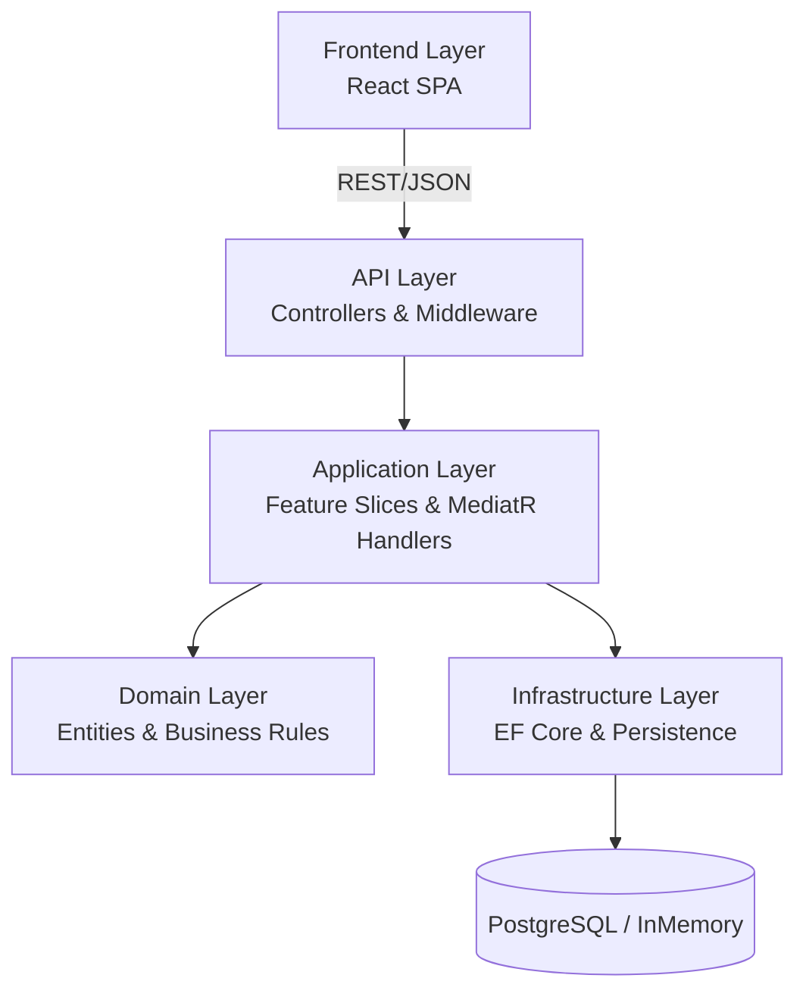

# TodoApp - Enterprise .NET Demo Application

[](https://dotnet.microsoft.com/)
[](https://learn.microsoft.com/en-us/ef/core/)
[](LICENSE)
[](docker-compose.yml)
[](http://localhost:8080/swagger)

> A production-ready .NET 8 Todo application with a React frontend, demonstrating enterprise architecture patterns, CQRS with MediatR, and feature-sliced design — all in a maintainable, testable demo.

---

## Overview

This application showcases how to build a modern, enterprise-grade .NET API using industry best practices. It implements a full task management system with users, tasks, and comments — structured around **feature slicing**, **CQRS**, and **clean architecture** principles.

The goal is to provide a reference implementation that balances pragmatism with architectural rigour, making it suitable for learning, demonstrations, and as a foundation for real-world projects.

---

## Frontend

The application includes a **React Single Page Application** that provides a modern, responsive user interface.

| Technology | Purpose |
|-----------|---------|
| React 18 | UI component library |
| TypeScript | Type-safe development |
| Vite | Build tool & dev server |
| Tailwind CSS | Utility-first styling |
| TanStack Query | Server state & caching |

### Pages

- **Login** — JWT authentication flow
- **Dashboard** — Overview of tasks and activity
- **Tasks** — Full task management with comments panel
- **Users** — User directory
- **Health** — System health monitoring

### Running the Frontend

```bash
cd frontend
npm install
npm run dev
```

Available at `http://localhost:3000` in development. Vite proxies API requests to the backend at `localhost:5000`.

In production (Docker), the frontend is served via **nginx** with API proxying configured in the container.

---

## Architecture



### Feature Slicing Pattern

Each feature is self-contained in a folder following the naming convention `[3-letter code][3-digit number][FeatureName]`:

| Code | Feature | Description |
|------|---------|-------------|
| `TSK001` | Tasks | Full CRUD for task management |
| `USR002` | Users | User registration and management |
| `CMT003` | Comments | Task commenting system |

Each feature folder contains:
- **`[Feature]Feature.cs`** — Endpoint logic, MediatR handlers, and database operations
- **`[Feature]FeatureSetup.cs`** — Service registration and endpoint mapping

> 📖 For full architecture documentation, see [`docs/`](docs/) (Arc42 format).

---

## Tech Stack

| Technology | Version | Purpose |
|-----------|---------|---------|
| .NET | 8.0 | Runtime & SDK |
| ASP.NET Core | 8.0 | Web framework |
| Entity Framework Core | 9.0.6 | ORM & data access |
| MediatR | 11.0 | CQRS & mediator pattern |
| PostgreSQL | 16 | Production database |
| React | 18 | Frontend UI library |
| TypeScript | 5.x | Type-safe frontend development |
| Vite | 5.x | Frontend build tool & dev server |
| Tailwind CSS | 3.x | Utility-first CSS framework |
| TanStack Query | 5.x | Server state management |
| Serilog | 8.0.3 | Structured logging |
| Swashbuckle | 6.9.0 | Swagger/OpenAPI documentation |
| JWT Bearer | 8.0.0 | Authentication |
| Asp.Versioning | 8.1.0 | API versioning |
| Docker Compose | — | Container orchestration |
| Testcontainers | 3.6.0 | Integration test infrastructure |
| FluentAssertions | 6.12.0 | Expressive test assertions |
| NSubstitute | 5.1.0 | Mocking framework |
| MSTest | 3.2.2 | Test framework |

---

## Getting Started

### Prerequisites

- [.NET 8 SDK](https://dotnet.microsoft.com/download/dotnet/8.0)
- [Docker & Docker Compose](https://docs.docker.com/get-docker/) (for containerised development)
- PostgreSQL 16+ (or use Docker)

### Running Locally

**Using .NET CLI (InMemory database):**

```bash
dotnet run
```

The API will be available at `http://localhost:5000` with Swagger UI at `/swagger`.

**Frontend (React SPA):**

```bash
cd frontend
npm install
npm run dev
```

The frontend will be available at `http://localhost:3000`. In development mode, Vite proxies API requests to `http://localhost:5000`.

**Using Docker Compose (full stack with PostgreSQL):**

```bash
docker-compose up --build
```

- API available at `http://localhost:8080`
- Frontend available at `http://localhost:3000`
- PostgreSQL on port `5432`

### Running Tests

```bash
cd tests/Application.Tests
dotnet test
```

Tests use **Testcontainers** to spin up isolated PostgreSQL instances, ensuring reliable integration testing without external dependencies.

---

## API Documentation

Interactive API documentation is available via **Swagger UI** at `/swagger` when the application is running.

### Endpoints

| Method | Endpoint | Description |
|--------|----------|-------------|
| `POST` | `/api/auth/token` | Obtain JWT authentication token |
| `GET` | `/api/v1/tasks` | List all tasks |
| `POST` | `/api/v1/tasks` | Create a new task |
| `GET` | `/api/v1/tasks/{id}` | Get task by ID |
| `PUT` | `/api/v1/tasks/{id}` | Update a task |
| `DELETE` | `/api/v1/tasks/{id}` | Delete a task |
| `GET` | `/api/v1/users` | List all users |
| `POST` | `/api/v1/users` | Register a new user |
| `GET` | `/api/v1/comments` | List comments |
| `POST` | `/api/v1/comments` | Add a comment to a task |

### Authentication

All protected endpoints require a valid JWT token in the `Authorization` header:

```
Authorization: Bearer <your-token>
```

Obtain a token via `POST /api/auth/token`.

---

## Project Structure

```
├── frontend/                 # React SPA (TypeScript, Vite, Tailwind CSS)
│   ├── src/
│   │   ├── pages/            # Login, Dashboard, Tasks, Users, Health
│   │   ├── components/       # Shared UI components
│   │   ├── contexts/         # AuthContext (JWT management)
│   │   └── api/              # API client & TanStack Query hooks
│   ├── Dockerfile            # Multi-stage: node build → nginx serve
│   └── package.json
├── API/
│   ├── Controllers/          # Thin API controllers
│   └── Middleware/            # Exception handling, cross-cutting concerns
├── Application/
│   ├── TSK001Tasks/          # Task management feature slice
│   ├── USR002Users/          # User management feature slice
│   └── CMT003Comments/       # Comments feature slice
├── Domain/
│   └── Entities/             # Domain models (TaskItem, User, Comment)
├── Infrastructure/           # AppDbContext, entity configurations
├── tests/
│   └── Application.Tests/    # Integration tests with Testcontainers
├── docs/
│   └── arc42/                # Architecture documentation (Arc42)
├── Program.cs                # Application bootstrap & middleware pipeline
├── docker-compose.yml        # Container orchestration
├── Dockerfile                # Multi-stage build (API)
└── TodoApp.sln               # Solution file
```

---

## Enterprise Patterns Demonstrated

| Pattern | Implementation |
|---------|---------------|
| **CQRS** | Separate Query/Command handlers via MediatR |
| **Feature Slicing** | Self-contained feature folders with registration, logic, and setup |
| **Clean Architecture** | Layered separation: API → Application → Domain → Infrastructure |
| **Repository Pattern** | EF Core DbContext as unit of work |
| **API Versioning** | URL segment, query string, and header-based versioning |
| **Rate Limiting** | Fixed-window rate limiter (100 requests/minute) |
| **Structured Logging** | Serilog with console and file sinks |
| **Health Checks** | Liveness and readiness probes for container orchestration |
| **JWT Authentication** | Stateless token-based security |
| **Exception Handling** | Global middleware with structured error responses |
| **CORS** | Configurable cross-origin resource sharing |
| **OpenAPI/Swagger** | Auto-generated, interactive API documentation |
| **Containerisation** | Docker multi-stage build with Compose orchestration |
| **Integration Testing** | Testcontainers for disposable database instances |

---

## Health & Monitoring

The application exposes health check endpoints compatible with Kubernetes and container orchestrators:

| Endpoint | Purpose | Description |
|----------|---------|-------------|
| `/health` | Liveness | Confirms the application process is running |
| `/health/ready` | Readiness | Validates all dependencies (database, etc.) are available |

Both endpoints return structured JSON responses:

```json
{
  "status": "Healthy",
  "checks": [
    {
      "name": "self",
      "status": "Healthy",
      "description": "Application is running."
    }
  ]
}
```

---

## Contributing

Contributions are welcome! Please follow these guidelines:

1. **Fork** the repository and create a feature branch
2. **Follow** the feature slicing pattern for new features
3. **Write tests** — at minimum: one happy path, one edge case, one failure case
4. **Use** conventional commits (e.g., `feat:`, `fix:`, `docs:`)
5. **Ensure** all tests pass before submitting a pull request

```bash
# Run tests before submitting
dotnet test

# Build to verify no compilation errors
dotnet build
```

---

## License

This project is licensed under the MIT License. See the [LICENSE](LICENSE) file for details.

---

<p align="center">
  Built with ❤️ as an enterprise .NET reference implementation
</p>
