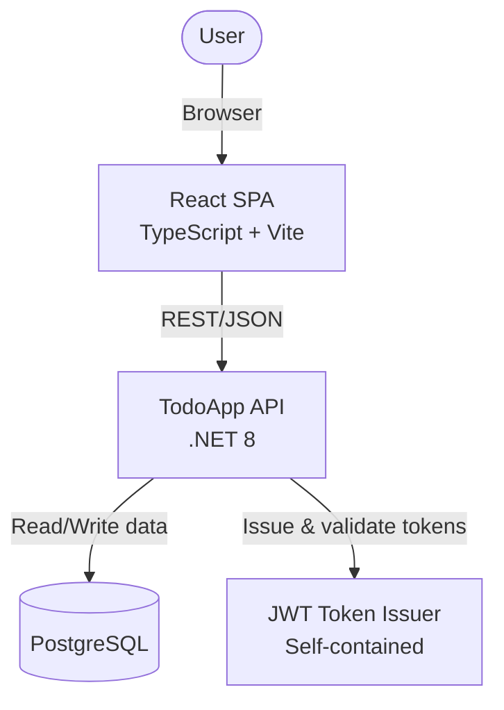

# 3. System Scope and Context

## Business Context

The TodoApp consists of a React SPA frontend and a .NET 8 API backend. Users interact with the system through the React application, which communicates with the API via REST/JSON over HTTP.

## External Interfaces

| Interface         | Technology       | Purpose                                      |
|-------------------|-----------------|----------------------------------------------|
| React SPA         | HTTP/Browser    | Primary user interface (served via nginx)     |
| REST API          | HTTP/JSON       | Backend interface consumed by the SPA         |
| PostgreSQL        | TCP/5432        | Persistent data storage                      |
| JWT Issuer        | Internal (HMAC) | Self-contained token generation and validation |
| Health Endpoints  | HTTP            | `/health` and `/health/ready` for monitoring |
| Swagger UI        | HTTP            | Interactive API documentation at `/swagger`  |

## Users and Roles

| Actor              | Description                                              |
|--------------------|----------------------------------------------------------|
| End User           | Interacts with the React SPA in a browser                |
| API Consumer       | Any HTTP client (SPA, mobile app, CLI) calling the API   |
| Authenticated User | A registered user who has obtained a JWT token           |
| Operations Team    | Monitors health checks and application logs              |

## System Boundary

The system boundary encompasses the React SPA, the ASP.NET Core API, and the managed PostgreSQL database. The SPA is the primary user-facing interface, communicating with the API exclusively through versioned REST endpoints. JWT token issuance is self-contained (symmetric key signing within the application). No external identity provider is currently integrated.

All API endpoints are versioned (default: `v1`) and protected by rate limiting. Authentication is required for task and comment operations. The SPA manages JWT tokens via an AuthContext and includes them as Bearer tokens in all authenticated requests.
