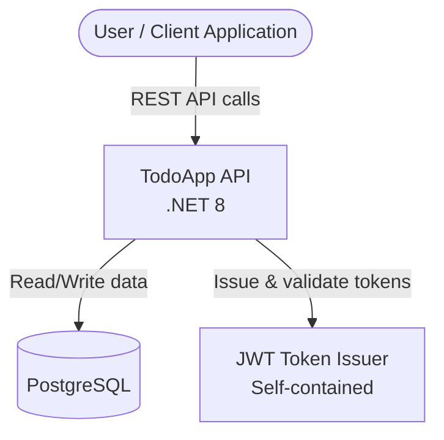

# 3. System Scope and Context

## Business Context

The TodoApp API serves as the backend for task management. External actors interact with the system through its REST API.

## External Interfaces

| Interface         | Technology       | Purpose                                      |
|-------------------|-----------------|----------------------------------------------|
| REST API          | HTTP/JSON       | Primary interface for all client interactions |
| PostgreSQL        | TCP/5432        | Persistent data storage                      |
| JWT Issuer        | Internal (HMAC) | Self-contained token generation and validation |
| Health Endpoints  | HTTP            | `/health` and `/health/ready` for monitoring |
| Swagger UI        | HTTP            | Interactive API documentation at `/swagger`  |

## Users and Roles

| Actor              | Description                                              |
|--------------------|----------------------------------------------------------|
| API Consumer       | Any HTTP client (SPA, mobile app, CLI) calling the API   |
| Authenticated User | A registered user who has obtained a JWT token           |
| Operations Team    | Monitors health checks and application logs              |

## System Boundary

The system boundary encompasses the ASP.NET Core application and its directly managed database. JWT token issuance is self-contained (symmetric key signing within the application). No external identity provider is currently integrated.

All API endpoints are versioned (default: `v1`) and protected by rate limiting. Authentication is required for task and comment operations.
