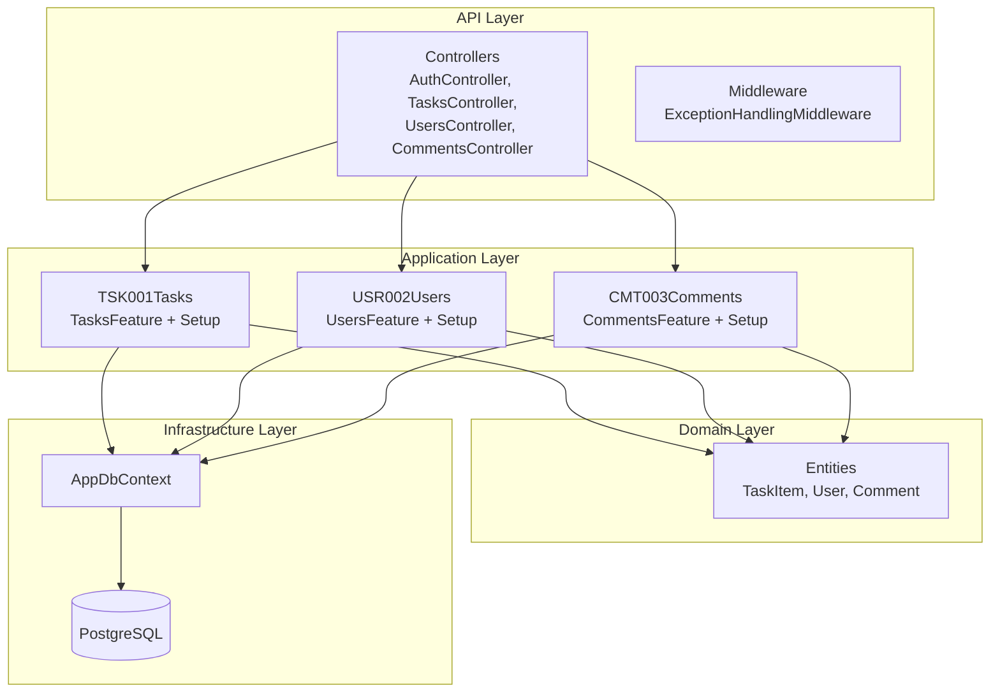

# 5. Building Block View

## Level 1 — System Layers

## Level 2 — Feature Folder Structure

Each feature follows a consistent internal structure:

| File                  | Responsibility                                      |
|-----------------------|-----------------------------------------------------|
| `*Feature.cs`         | Commands, Queries, and their MediatR Handlers       |
| `*FeatureSetup.cs`    | Service registration (DI) and endpoint mapping      |

### Feature Catalogue

| Code    | Feature   | Commands              | Queries                        |
|---------|-----------|----------------------|-------------------------------|
| TSK001  | Tasks     | `CreateTaskCommand`   | `GetAllTasksQuery`, `GetTasksByUserQuery` |
| USR002  | Users     | `RegisterUserCommand` | `GetAllUsersQuery`            |
| CMT003  | Comments  | (Create comment)      | (Get comments by task)        |

## Level 3 — Domain Entities

| Entity     | Properties                                    |
|------------|-----------------------------------------------|
| `TaskItem` | Id, Title, IsCompleted, UserId, User          |
| `User`     | Id, Username                                  |
| `Comment`  | Id, Content, TaskItemId, UserId (inferred)    |

## Cross-cutting Components

- **ExceptionHandlingMiddleware** — catches unhandled exceptions, returns ProblemDetails
- **Program.cs** — composition root wiring authentication, rate limiting, CORS, health checks, Serilog, and Swagger
