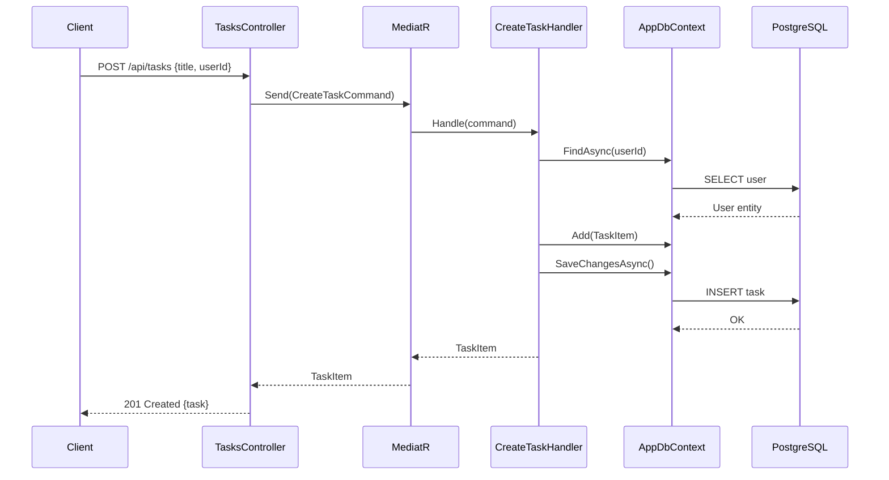
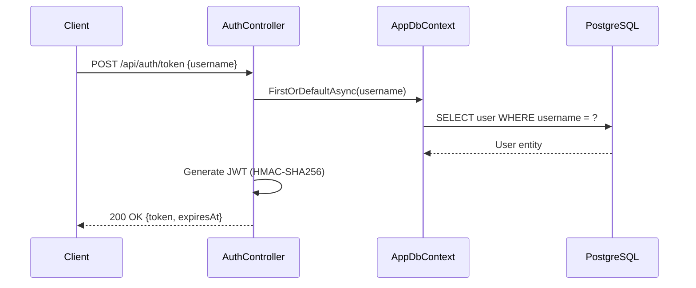
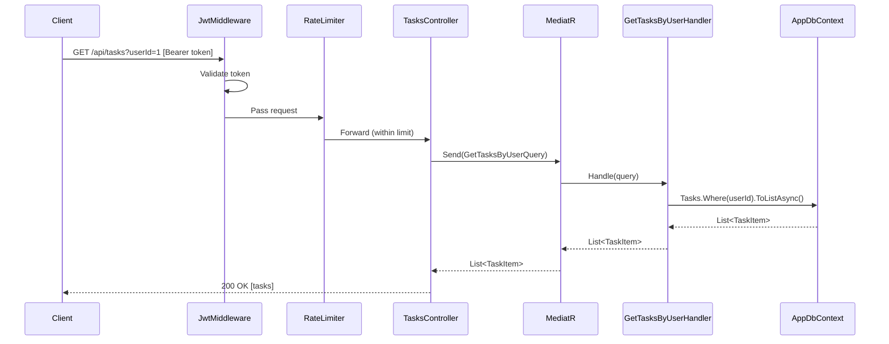

# 6. Runtime View

## Scenario 1 — Create Task

## Scenario 2 — Authenticate (Get Token)

## Scenario 3 — Get Tasks by User (with Authentication)

## Error Handling Flow

When an unhandled exception occurs, the `ExceptionHandlingMiddleware` catches it, logs it via Serilog, maps it to an appropriate HTTP status code, and returns a RFC 7807 `ProblemDetails` JSON response.
