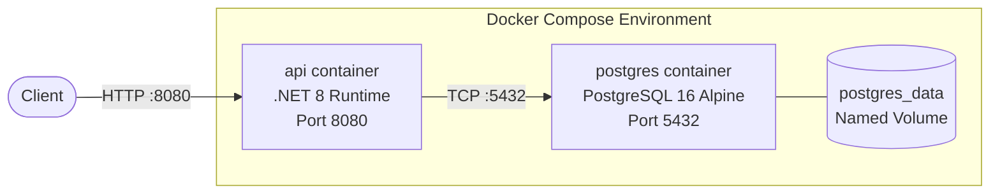

# 7. Deployment View

## Container Topology



## Docker Compose Services

| Service    | Image                              | Port  | Purpose                    |
|-----------|-------------------------------------|-------|----------------------------|
| `api`      | Custom (multi-stage Dockerfile)    | 8080  | ASP.NET Core application   |
| `postgres` | `postgres:16-alpine`               | 5432  | Persistent data storage    |

## Dockerfile Strategy

The application uses a multi-stage Docker build:

1. **Build stage** (`dotnet/sdk:8.0`) — Restores packages, compiles, and publishes the application
2. **Runtime stage** (`dotnet/aspnet:8.0`) — Minimal runtime image with only the published output

## Environment Variables

| Variable                                  | Service  | Purpose                          |
|------------------------------------------|----------|----------------------------------|
| `ConnectionStrings__DefaultConnection`    | api      | PostgreSQL connection string     |
| `ASPNETCORE_URLS`                        | api      | Bind to `http://+:8080`         |
| `POSTGRES_DB`                            | postgres | Database name (`todoapp`)        |
| `POSTGRES_USER`                          | postgres | Database user (`todoapp`)        |
| `POSTGRES_PASSWORD`                      | postgres | Database password                |

## Health Monitoring

| Endpoint         | Purpose                              |
|------------------|--------------------------------------|
| `/health`        | Basic liveness check                 |
| `/health/ready`  | Readiness check (all dependencies)   |

## Running Locally

```bash
docker compose up --build
# API available at http://localhost:8080
# Swagger UI at http://localhost:8080/swagger
```
