# 10. Quality Requirements

## Quality Tree

```mermaid
graph TD
    Quality[Quality Goals]
    Quality --> Performance
    Quality --> Security
    Quality --> Maintainability
    Quality --> Testability
    Quality --> Operability

    Performance --> RateLimiting[Rate Limiting<br/>100 req/min]
    Performance --> AsyncHandlers[Async handlers<br/>non-blocking I/O]

    Security --> JWT[JWT Bearer Auth<br/>HMAC-SHA256]
    Security --> InputVal[Input Validation<br/>via model binding]
    Security --> CORS[CORS Policy<br/>origin restriction]

    Maintainability --> FeatureSlice[Feature Slicing<br/>isolated features]
    Maintainability --> CQRS[CQRS Separation<br/>commands vs queries]
    Maintainability --> CleanDeps[Clean Dependencies<br/>DI throughout]

    Testability --> IntTests[Integration Tests<br/>Testcontainers]
    Testability --> BDD[BDD/Gherkin<br/>behaviour specs]
    Testability --> MockFriendly[Mock-friendly<br/>NSubstitute]

    Operability --> HealthChecks[Health Checks<br/>/health endpoints]
    Operability --> Logging[Structured Logging<br/>Serilog]
    Operability --> Docker[Docker Support<br/>containerised deploy]
```

## Quality Scenarios

| ID   | Quality       | Scenario                                                                 | Metric                        |
|------|--------------|--------------------------------------------------------------------------|-------------------------------|
| QS-1 | Performance  | Under sustained load, the API responds within acceptable latency         | < 200ms p95 at 100 req/min   |
| QS-2 | Security     | Unauthenticated requests to protected endpoints are rejected             | 401 response, no data leakage|
| QS-3 | Maintainability | A new feature can be added without modifying existing feature code     | Zero changes to other folders |
| QS-4 | Testability  | Every feature has passing integration tests in CI                        | 3+ tests per feature          |
| QS-5 | Operability  | Container orchestrator can determine application health                  | `/health` returns within 1s   |
| QS-6 | Security     | Excessive requests are throttled                                         | HTTP 429 after 100 req/min    |

## Compliance

- Error responses follow RFC 7807 (ProblemDetails)
- API versioning follows Microsoft REST API guidelines
- JWT tokens follow RFC 7519
- Health check responses follow ASP.NET Core conventions for Kubernetes readiness/liveness probes
